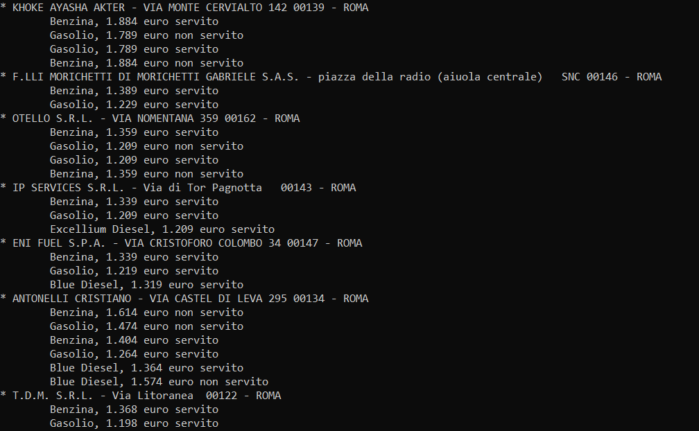
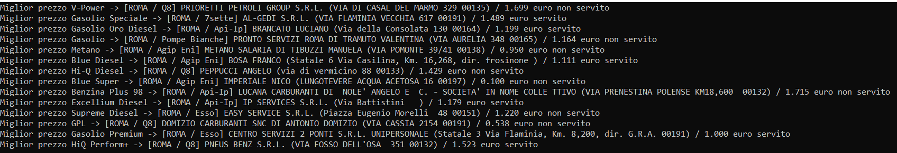

# CLIFUEL

cliFuel is a command line fuel price finder for Italy

This program is based on open data published every day by Ministero Dello Sviluppo Economico.
The database URL is:

- [anagrafica_impianti_attivi.csv](https://www.mise.gov.it/images/exportCSV/anagrafica_impianti_attivi.csv)
- [prezzo_alle_8.csv](https://www.mise.gov.it/images/exportCSV/prezzo_alle_8.csv)

## Examples

- Simple search

```
$ ./cliFuel -q roma -s
```

<center>
    
</center>

- Search for best price

```
$ ./cliFuel -q roma
```

or use list notation

```
$ ./cliFuel -q list:roma,milano,trieste
```

<center>
    
</center>

it is also possible to search for a particular petrol station by its ID

```
$ ./cliFuel -q id:3000
```

or by province

```
$ ./cliFuel -q prov:RM
```

for other usage tips, use the -h command

```
$ ./cliFuel -h
```

## Libraries linked statically

1. https://sourceforge.net/projects/cccsvparser/
2. https://github.com/rxi/log.c
3. https://github.com/rxi/map
4. https://github.com/doches/progressbar
5. https://github.com/rxi/dmt

## Libraries linked dynamically

1. https://curl.haxx.se/libcurl/c/libcurl.html

## CliFuel as Docker service with email notification

It is possible to receive cliFuel elaborations on your email using the Docker 
container which can be created as follows

### To build your own Docker image run

```
$ docker build -t clifuel --build-arg ARG_ACCOUNT_GMAIL_TO=<your user> \
--build-arg ARG_ACCOUNT_GMAIL_USER=<your user> \
--build-arg ARG_ACCOUNT_GMAIL_PASSWORD=<your password> --progress=plain .
```

By default during docker build is cloned "master" branch to override this behavior 
add ARG_GIT_BRANCH=<dev> argument to the build command

### To run the Docker container using your preference

```
$ docker run --name clifuel --rm clifuel -q <your place>
```

## License

[](http://www.gnu.org/licenses/gpl-3.0.en.html)

This application is Free Software: You can use, study share and improve it at your
will. Specifically you can redistribute and/or modify it under the terms of the
[GNU General Public License](https://www.gnu.org/licenses/gpl.html) as
published by the Free Software Foundation, either version 3 of the License, or
(at your option) any later version.
